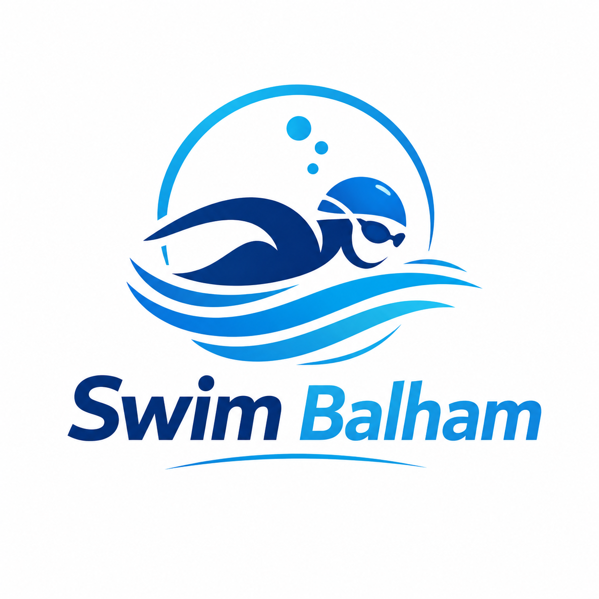

# Swim Balham



Swim Balham is a free Windows desktop app for the Balham community. It helps people find public swimming and training sessions at Balham Leisure Centre and nearby Tooting Bec Lido, see current availability, and open the relevant booking page.

## Features

- Live session and facility availability from the Places Leisure OpenActive feeds
- Filters for centre, date, time of day, category, and availability
- Direct links to the Places Leisure booking service when a deep link is available
- Availability reminders for full sessions
- Local caching for a fast start and useful offline display
- A portable, single-file Windows executable with no installer or administrator access required

## Download

Download `SwimBalham.exe` from the [latest GitHub release](https://github.com/zmobariz/SwimBalham/releases/latest) and run it from any folder you can write to. It does not install a service, change system settings, or require administrator access.

Early releases may still show a Microsoft Defender SmartScreen reputation warning. Only run a copy downloaded from this repository's Releases page, and verify the supplied SHA-256 checksum or GitHub artifact attestation if you are unsure.

## Reminder behaviour

Choose a full session and select **Remind me when available**. Swim Balham checks the live feed during each refresh and shows a popup if a space opens.

The app must remain running for this reminder to work. Swim Balham does not reserve or book the session automatically, and availability can change before the Places Leisure booking page opens.

## Privacy

Swim Balham has no accounts, analytics, advertising, or telemetry. It makes network requests only to obtain timetable data and open booking/support pages you choose.

Settings and cached timetable data are stored for the current Windows user in:

```text
%LOCALAPPDATA%\SwimBalham
```

Delete that folder to remove all locally stored app data.

## Run from source

Python 3.13 is used for release builds.

```powershell
py -3.13 -m venv .venv
.\.venv\Scripts\Activate.ps1
python -m pip install -r requirements.txt
python app.py
```

Run the tests with:

```powershell
python -m unittest discover -s tests -v
```

## Build the portable executable

```powershell
python -m pip install -r requirements-dev.txt
pyinstaller --noconfirm --clean build.spec
```

The executable is created at `dist\SwimBalham.exe`. The PyInstaller configuration explicitly uses a standard `asInvoker` manifest (`uac_admin=False`), so Windows does not request elevation.

GitHub Actions builds release artifacts and generates a SHA-256 checksum and a GitHub artifact attestation. An attestation proves which public workflow and commit produced a file; it is separate from Windows Authenticode publisher signing.

## Data attribution and disclaimer

Timetable data is made available by Places Leisure through its OpenActive/LeisureCloud feeds under the [Creative Commons Attribution 4.0 International licence](https://creativecommons.org/licenses/by/4.0/). Places Leisure is the source of the session data; this project may transform or cache it for display.

Swim Balham is an independent community project. It is not an official Places Leisure product and is not affiliated with, endorsed by, or responsible for the Places Leisure booking service. Always confirm session details, prices, eligibility, and availability on the official booking page.

## Support Swim Balham

Found your swim? Brilliant.

If Swim Balham has helped you secure a session, stay organised, or avoid missing a swim, you can support its continued development by [buying me a coffee](https://ko-fi.com/syrexeno).

Your support helps cover the cost of keeping the app running, improving reminders, and making it even easier to find your next swim.

Enjoy your session — and thank you for supporting Swim Balham.

## Licence

The source code is released under the [MIT License](LICENSE). Third-party packages and timetable data remain subject to their own licences.
